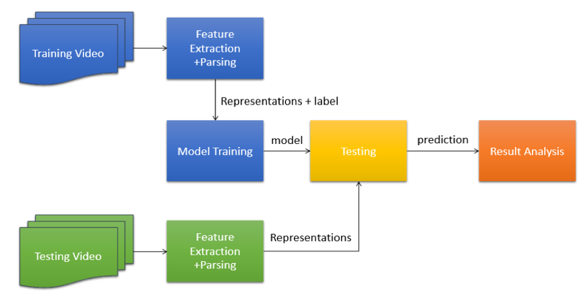

# Large-Scale Multimedia Analysis

Repository for 11775 SG Large-Scale Multimedia Analysis (Spring 2020) - Carnegie Mellon University 

Course Website(https://baljit-cmu.github.io/11775.github.io/)

High-Potential Individuals Global Training Program supported by IITP Korea.

https://www.lti.cs.cmu.edu/iitp-executive-education-course-spring-2020

## Pipeline

## [HW1](https://github.com/yongkyung-oh/CMU-Large_Scale_Multimedia_Analysis/tree/master/hw1_code)
The task of homework 1 is to perform multimedia event detection (MED) with audio features. Main tasks are extract MFCC and ASRs features from video file and develop model for multiple events. For the MFCC, Kmeans clustering is used to define features. In the ASRs, customized vocabulary dictionary using NLTK is used for features. SVM classifier is developed for the baseline and customized classification approach is suggested.

## [HW2](https://github.com/yongkyung-oh/CMU-Large_Scale_Multimedia_Analysis/tree/master/hw2_code)
The task of homework 2 is to perform multimedia event detection (MED) with video features. Main tasks are extract SURF and CNN features from video file and develop model for multiple events. For the SURF and CNN, Kmeans clustering is used to define and represent features. in CNN, Vector of Locally Aggregated Descriptors (VLAD) Encoding technique is implemented to extract additional features. Also, CNN features are used to classifier without representation step. SVM classifier and LGBM are developed for the baseline and customized classification approach is suggested.
